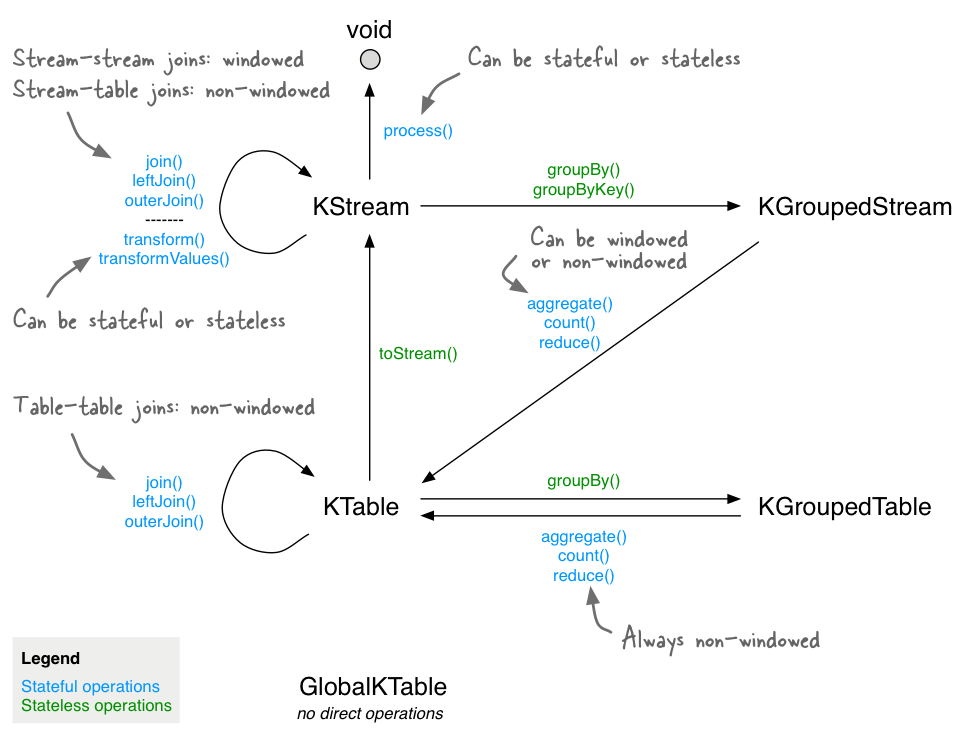

# Kafka Streams Course

Repository to put in practice concepts of Kafka Streams Course

---



## How to practice with applications

Up Kafka environment

```shell
docker-compose up -d
```

Access your kafka broker

```shell
docker ps # Find the kafka container ID

docker exec -it <Kafka Container ID> bash
```

### Word Count

Create input topic

```shell
kafka-topics --bootstrap-server localhost:9092 \ 
  --create \ 
  --topic word-count-input \ 
  --partitions 3
```

Create output topic

```shell
kafka-topics --bootstrap-server localhost:9092 \ 
  --create \ 
  --topic word-count-output \ 
  --partitions 3
```

Produce data to be streamed

```shell
kafka-console-producer --bootstrap-server localhost:9092 --topic word-count-input
```

Consume the stream generate

```shell
kafka-console-consumer --bootstrap-server localhost:9092 \
  --topic word-count-output \
  --from-beginning \
  --formatter kafka.tools.DefaultMessageFormatter \
  --property print.key=true \
  --property print.value=true \
  --property key.deserializer=org.apache.kafka.common.serialization.StringDeserializer \
  --property value.deserializer=org.apache.kafka.common.serialization.LongDeserializer
```

### Favourite Color

Create input topic

```shell
kafka-topics --bootstrap-server localhost:9092 \ 
  --create \ 
  --topic favourite-color-input \ 
  --partitions 3
```

Create intermediary topic

```shell
kafka-topics --bootstrap-server localhost:9092 \ 
  --create \ 
  --topic favourite-color-stream \ 
  --partitions 3 \
  --config cleanup.policy=compact
```

Create output topic

```shell
kafka-topics --bootstrap-server localhost:9092 \ 
  --create \ 
  --topic favourite-color-output \ 
  --partitions 3
```

Produce data to be streamed

```shell
kafka-console-producer --bootstrap-server localhost:9092 --topic favourite-color-input
```

Consume the stream generate

```shell
kafka-console-consumer --bootstrap-server localhost:9092 \
  --topic favourite-color-output \
  --from-beginning \
  --formatter kafka.tools.DefaultMessageFormatter \
  --property print.key=true \
  --property print.value=true \
  --property key.deserializer=org.apache.kafka.common.serialization.StringDeserializer \
  --property value.deserializer=org.apache.kafka.common.serialization.LongDeserializer
```
